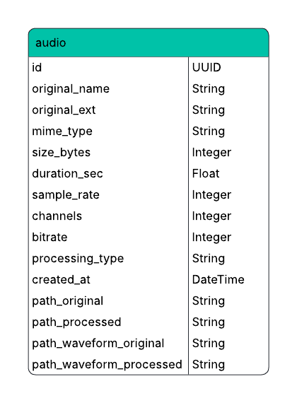
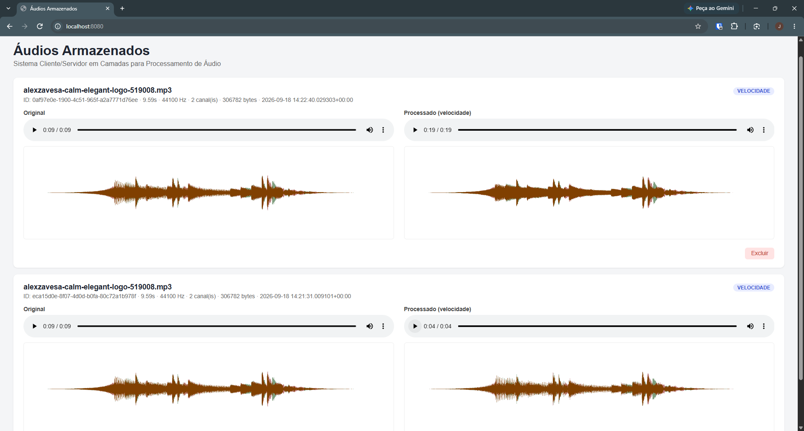
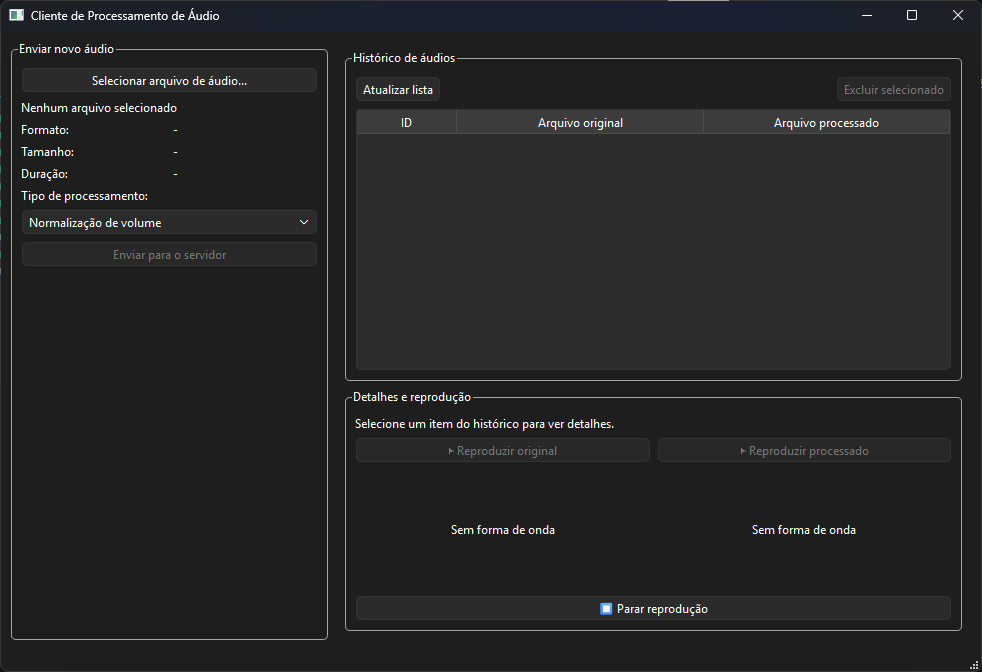
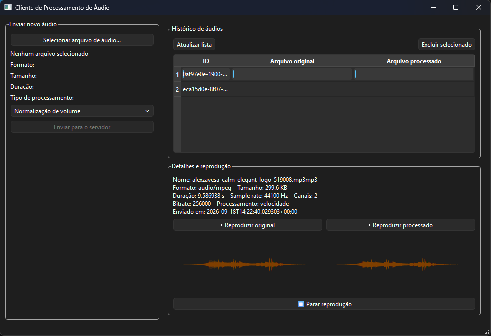

# Trabalho 03 - Sistema Distribuido
### Sistema Cliente/Servidor em Camadas para Processamento de Áudio
## Objetivo

O objetivo deste trabalho é desenvolver um sistema cliente/servidor em três camadas capaz de realizar o envio, processamento e armazenamento organizado de arquivos de áudio. O sistema permite que o cliente selecione um arquivo, escolha o tipo de processamento desejado e envie o áudio ao servidor, que será responsável por realizar as operações de processamento e armazenar os arquivos e seus respectivos metadados em um banco de dados PostgreSQL.

## Tecnologias Utilizadas

- ####  Python 3
- ####  FastAPI
- ####  PySide6
- ####  FFmpeg
- ####  PostgreSQL
- ####  Docker
- ####  SQLAlchemy
- ####  Dois computadores distintos

## Como Executar o Servidor FastAPI
### Pré-requisitos

- Docker instalado na máquina

Para executar o projeto no Docker, acesse a pasta raiz do projeto e execute o comando abaixo:

```bash
docker compose up --build -d
```
- FastAPI: disponível na porta 8080 — http://localhost:8080
- PostgreSQL: disponível na porta 5432 — http://localhost:5432

Para remover os containers em execução:

```bash
docker compose down
```

## Como Executar o Cliente PySide6

### 1. Crie um ambiente virtual Python

```bash
python -m venv .venv
```

### 2. Ative o ambiente virtual

**Windows (cmd/PowerShell):**
```bash
.venv\Scripts\activate
```

**Linux/macOS:**
```bash
source .venv/bin/activate
```

### 3. Instale as dependências

```bash
pip install PySide6 requests
```

### 4. Acesse a pasta do cliente

```bash
cd client
```

### 5. Execute o aplicativo

```bash
python client.py
```

 **Importante:** o servidor FastAPI precisa estar rodando antes de abrir o cliente (veja a seção de execução do servidor). Se o endereço do servidor for diferente de `localhost:8080`, ajuste a constante `BASE_URL` no topo do `client.py` antes de executar.

## Processamento de Áudio Disponivel

- **Normalização de volume:** ajusta o nível de volume do áudio.
- **Conversão para mono:** converte o áudio para um único canal.
- **Alteração da velocidade de reprodução:** aumenta ou reduz a velocidade do áudio.
- **Redução da taxa de bits:** diminui o bitrate para reduzir o tamanho do arquivo.
- **Conversão de formato:** permite converter o áudio para diferentes formatos.

## Estrutura de Arquivos

```
Trabalho_SD_03
├─ client
│  └─ client.py
├─ docker-compose.yml
├─ Dockerfile
├─ README.md
├─ requirements.txt
└─ server
   ├─ database
   │  ├─ database.py
   │  ├─ init_db.py
   │  └─ models.py
   ├─ main.py
   ├─ router
   │  ├─ receive_audio.py
   │  ├─ search_audio.py
   │  └─ web.py
   ├─ services
   │  ├─ audio_processor.py
   │  ├─ audio_repository.py
   │  └─ get_audio.py
   └─ templates
      └─ index.html

```
## Configuração do banco de dados.



## Prints das Interfaces

### Interface Web


### Interface do cliente (GUI com PySide6)





